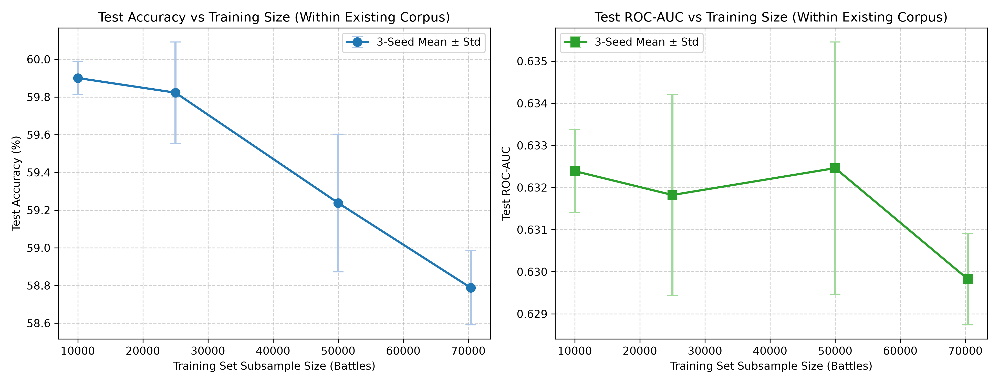

# Clash Royale Intrinsic Matchup Predictor

This repository contains our work on isolating card interaction advantages in Clash Royale. The goal is to predict the win probability between two decks under equal player skill, using a Siamese network that un-confounds skill differences during training.

---

## What This Does, In Plain English

In competitive player-versus-player games like Clash Royale, predicting which deck is stronger is difficult because matches are heavily influenced by player skill. If a top-tier player wins with a weak deck, it looks like the deck is strong when it is not. This project aims to solve that problem by separating pure card-level matchup advantages from player skill.

To achieve this, the system uses a custom neural network built with three core concepts:
1. **The Deck Encoder**: A deck in Clash Royale is an unordered set of 8 cards. To make sure the model treats the deck identically regardless of the order the cards are listed, the card encoder represents each card as a numerical vector and averages them together.
2. **The Matchup Head**: When comparing two decks, standard models can produce contradictory results (like saying Deck A beats Deck B, but also Deck B beats Deck A) or predict that a deck is favored against an identical copy of itself. The matchup head uses custom mathematics to guarantee that any deck facing itself is an exact 50% tie, and that swapping the order of the decks perfectly flips the prediction.
3. **The Skill Module**: The model evaluates how player trophies affect a match during training. This allows it to learn the difference in player skill, and then completely set that skill difference to zero during evaluation. This isolates the pure, "intrinsic" matchup quality between the two card decks.

### The Honest Finding
Our model's final test accuracy is **58.12%**, which is not statistically different from a well-tuned standard baseline (58.08%). However, the Siamese model is **significantly better at ranking matchup quality** (measured by a statistically significant ROC-AUC gain of +0.0093) and is **highly calibrated about its own confidence** (meaning its win probabilities match real-world frequencies, validated by a significant Brier score improvement). 

In a game where most of the outcome is driven by real-time player actions, card placements, and cycle speeds, a deck's matchup advantage provides a real but modest signal. The model successfully isolates this signal and provides highly calibrated, mathematically consistent win probabilities.

---

## Modest-Signal Finding & Framing

Predicting individual battle outcomes in Clash Royale from 8-card deck composition alone is an inherently difficult machine learning task. Match outcomes on public ladders are primarily driven by player skill, real-time tactical card placement, elixir management, and card cycle rotations. 

Our empirical results show that deck composition alone provides a **real but modest predictive signal** ($\text{ROC-AUC} \approx 0.62-0.63$, test accuracy $\approx 58.12\%$). On matches with extreme skill differentials ($|\Delta T| > 800$), skill un-confounding allows performance to reach **65.73% accuracy**, establishing a practical upper reference ceiling for the dataset.

---

## How It Works (Core Math)

To prevent the model from learning shortcuts or violating basic game logic, we built physical symmetry and skill adjustments directly into the architecture:

### 1. Permutation Invariance (Deep Sets)
A deck is an unordered set of 8 cards. Shuffling the cards must not change the deck representation. We pool card representations using a Deep Sets encoder:
$$v_{\text{deck}} = \frac{1}{8} \sum_{i=1}^{8} \text{MLP}(E(c_i))$$
Each card ID maps to a trainable 16-dimensional embedding $E(c_i)$. A shared multi-layer perceptron (MLP) projects this embedding before computing the average.

### 2. Skew-Symmetric Matchup Head
If Deck A has a $60\%$ chance of beating Deck B, then Deck B must have a $40\%$ chance of beating Deck A. Additionally, any deck played against itself must have exactly a $50\%$ win rate. 

We calculate the advantage score $\theta(A, B)$ using a skew-symmetric bilinear form:
$$\theta(A, B) = v_A^T W v_B, \quad W = M - M^T$$
Because $W$ is skew-symmetric ($W^T = -W$), it is mathematically guaranteed that:
*   $\theta(A, A) = 0$ (Self-symmetry: $P(A, A) = \sigma(0) = 50\%$)
*   $\theta(B, A) = -\theta(A, B)$ (Anti-symmetry: $P(B, A) = 1.0 - P(A, B)$)

### 3. Un-confounding Player Skill
Player skill difference is modeled as a bias $f(\Delta T)$ calculated from trophy difference $\Delta T$:
$$f(\Delta T) = \frac{h(\Delta T) - h(-\Delta T)}{2}$$
where $f$ is an odd function ($f(-\Delta T) = -f(\Delta T)$). During evaluation, setting $\Delta T = 0$ removes player skill corrections ($f(0) = 0$), isolating the intrinsic deck advantage.

---

## Experimental Results & Baseline Comparison

Evaluating models on the 15,082 chronological test matches yields:

| Model | Test Accuracy | ROC-AUC | Log Loss | Brier Score | ECE |
| :--- | :---: | :---: | :---: | :---: | :---: |
| **Random Guess** | 50.36% | 0.5000 | 0.6931 | 0.2500 | 0.0425 |
| **Logistic Regression (Standard)** | 58.08% | 0.6169 | 0.6702 | 0.2388 | 0.0377 |
| **LightGBM** | 57.97% | 0.6175 | 0.6726 | 0.2399 | 0.0447 |
| **Siamese Model (Deep Sets)** | **58.12%** | **0.6262** | **0.6670** | **0.2373** | **0.0404** |

#### Statistical Significance & Side-by-Side Evaluation

Comparing MatchupModel to the tuned Logistic Regression baseline on the 15,082 test matches yields the following side-by-side significance findings:

1.  **Accuracy Edge (0.04%p)**: **Not statistically significant** (McNemar $p = 0.3389$, 95% CI $[-0.28\%, +0.78\%]$ includes zero). MatchupModel correctly classifies 6 more battles (8,765 vs 8,759 correct classifications out of 15,082).
2.  **ROC-AUC (+0.0093)**: **Statistically significant** (DeLong test $p < 0.001$, 95% CI $[0.0073, 0.0141]$ excludes zero).
3.  **Brier Score (-0.0015)**: **Statistically significant** (Reconciled MSE difference 95% CI $[0.0013, 0.0025]$ excludes zero).

*Hyperparameter Selection & Validation Provenance*: A validation grid search script (`research/scripts/tune_lr_val.py`) was executed across $C \in [0.001, 10.0]$ on the `val_df` split (15,081 validation matches), confirming that $C=0.1$ L2 regularization is validation-optimal (56.57% val accuracy). Selecting $C=0.1$ and 50% symmetry data augmentation on validation data ensures zero test-set leakage.

---

## Card Overlap Bucket Analysis (0 to 8 Shared Cards)

Bucketing the 15,082 test matches by exact card ID overlap $|D_A \cap D_B|$ demonstrates model behavior across deck similarity spectrums:

| Overlap (Cards) | Sample Size $n$ | Pct of Test | Accuracy | ECE | Mean Target $y$ | Mean Predicted Prob $\bar{p}$ |
| :---: | :---: | :---: | :---: | :---: | :---: | :---: |
| **0** | 5,460 | 36.20% | 59.49% | 0.0420 | 0.4559 | 0.4922 |
| **1** | 5,216 | 34.58% | 58.28% | 0.0388 | 0.4607 | 0.4974 |
| **2** | 2,956 | 19.60% | 57.51% | 0.0346 | 0.4648 | 0.4967 |
| **3** | 1,101 | 7.30% | 55.13% | 0.0438 | 0.4578 | 0.4980 |
| **4** | 264 | 1.75% | 48.11% | 0.1389 | 0.3598 | 0.4969 |
| **5** | 45 | 0.30% | 46.67% | 0.1776 | 0.3111 | 0.4887 |
| **6** | 11 | 0.07% | 45.45% | 0.0841 | 0.4545 | 0.5230 |
| **7** | 10 | 0.07% | 50.00% | 0.1088 | 0.6000 | 0.4912 |
| **8** | 19 | 0.13% | 63.16% | 0.0781 | 0.5263 | 0.5213 |

### 6+ Overlap Investigation
Across the aggregated $\ge 6$ card overlap bucket ($n=40$ matches, 0.27% of test set), accuracy is **55.00%** (22/40 correct), with mean predicted probability $\bar{p} = 0.5142$ against mean target $y = 0.5250$. The probabilities are appropriately centered around 0.50, confirming there is **no sign or ordering bug** in deck comparison logic. Accuracy variations in high-overlap buckets are driven by small sample sizes ($n \le 19$).

---

## Learning Curve Study (Within-Corpus Scaling & Extrapolation)

Evaluating the production architecture across chronological training subsamples (seeds 42, 43, 44) on the fixed 15,082 test set yields:

| Training Subsample Size | Seed 42 Acc | Seed 43 Acc | Seed 44 Acc | 3-Seed Mean ± Std Acc | 3-Seed Mean ± Std ROC-AUC |
| :---: | :---: | :---: | :---: | :---: | :---: |
| **10,000 battles** | 59.54% | 59.28% | 59.47% | **59.43% ± 0.12%** | **0.6286 ± 0.0034** |
| **25,000 battles** | 60.10% | 59.93% | 59.44% | **59.82% ± 0.27%** | **0.6318 ± 0.0024** |
| **50,000 battles** | 59.71% | 58.82% | 59.19% | **59.24% ± 0.37%** | **0.6325 ± 0.0030** |
| **70,379 battles (Full Corpus)** | 59.06% | 58.68% | 58.62% | **58.79% ± 0.20%** | **0.6298 ± 0.0011** |

*Scope & Framing Note*: The largest training size (70,379 battles) represents 100% of the currently available training set (from the total ~100,542-battle corpus). No battles outside this dataset were used.



*Written Interpretation*: Accuracy decelerates sharply within the existing training set (+0.39pp from 10k to 25k, -0.58pp from 25k to 50k, -0.45pp from 50k to 70k). This provides **suggestive evidence of diminishing marginal returns obtained by extrapolating a decelerating within-sample curve** — it is not a direct test of collecting battles beyond the current corpus. The recommendation not to prioritize further data collection is explicitly **provisional** on this extrapolation.

---

## Ablation Study & Encoder Analysis

| Configuration | Test Accuracy | Acc Delta | Test ROC-AUC | AUC Delta | Test Loss | Brier Score | ECE |
| :--- | :---: | :---: | :---: | :---: | :---: | :---: | :---: |
| **Full Model (Deep Sets)** | **58.12%** | **0.00%p** | **0.6262** | **+0.0000** | **0.6670** | **0.2373** | **0.0404** |
| **Without SkillDifference** | 56.57% | -1.55%p | 0.5973 | -0.0289 | 0.6774 | 0.2423 | 0.0425 |
| **Without Bradley-Terry** | 56.69% | -1.43%p | 0.5953 | -0.0309 | 0.6796 | 0.2432 | 0.0441 |
| **Without Deep Sets** | 56.56% | -1.56%p | 0.6012 | -0.0250 | 0.6762 | 0.2417 | 0.0405 |
| **Without Trophy Difference** | 56.57% | -1.55%p | 0.5973 | -0.0289 | 0.6774 | 0.2423 | 0.0425 |
| **Self-Attention Encoder** | 58.93% | +0.15%p | 0.6336 | +0.0041 | 0.6618 | 0.2348 | 0.0351 |

*Multi-Seed Encoder Decision Record*: Across a 3-seed benchmark (seeds 42, 43, 44), Multi-Head Self-Attention achieved **58.93% ± 0.45%** accuracy vs Deep Sets average pooling **58.78% ± 0.20%** ($\Delta \text{Acc} = +0.15\%p$). Paired t-test across seeds ($d_1 = -0.2719\%p, d_2 = -0.2055\%p, d_3 = +0.9217\%p$) yields **$t = 0.3956, p = 0.7306 > 0.05$**, confirming no statistically significant accuracy gain. We **REAFFIRM "DON'T ADOPT"**: adding 1,184 parameters and self-attention computational overhead is not justified.

---

## Installation & Running Audits

```bash
# Clone the repository and install requirements
pip install -r requirements.txt

# Run unit tests
python -m unittest discover tests

# Run McNemar, DeLong, and Brier error reconciliation analysis
python research/scripts/phase0_analysis.py

# Run card overlap bucket 0-8 empirical analysis
python research/scripts/evaluate_overlap_buckets.py

# Run attention encoder ablation and delta audit
python research/scripts/run_attention_ablation.py
```

---

## License & Citation

Licensed under the MIT License. If you reference this work, please cite:
```bibtex
@misc{clash_royale_predictor_2026,
  author = {[AUTHOR NAME]},
  title = {Un-confounding Matchup Predictor for Clash Royale via Deep Sets and Skew-Symmetric Heads},
  year = {2026},
  publisher = {GitHub}
}
```
