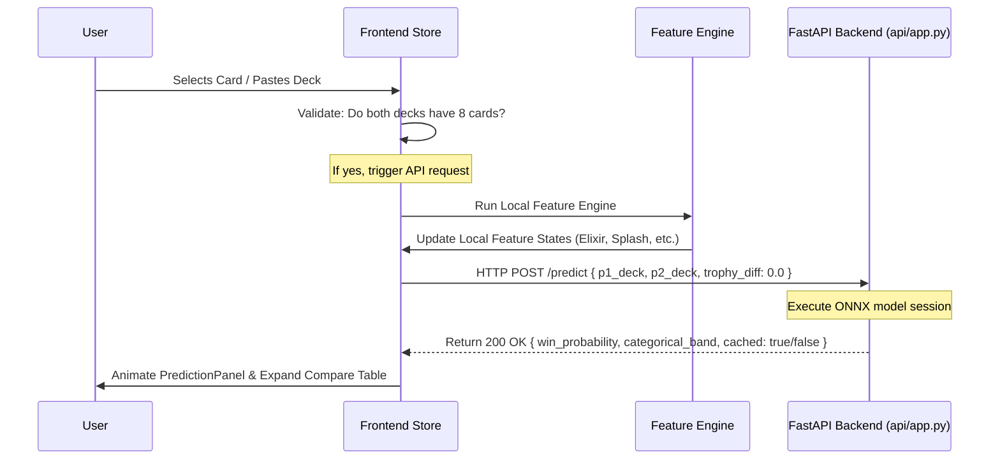

# Technical Architecture Specification
## Clash Royale Matchup Predictor — Version 1.0.0

---

## 1. Application Folder Structure

A standardized frontend project layout (compatible with React/Vite or Next.js structures):

```
/
├── public/                 # Static assets (favicons, generic fallbacks)
│   └── assets/
│       └── cards/          # Local card thumbnail cache if API is offline
├── src/
│   ├── components/         # Reusable UI Components
│   │   ├── DeckBuilder/    # Deck slot grid, action buttons
│   │   ├── CardPicker/     # Card selection grid, search bar
│   │   ├── Prediction/     # Win rate panel, calibration info
│   │   └── Library/        # Meta deck tabs and lists
│   ├── config/             # Static configurations & lists
│   │   └── card_library.json
│   ├── services/           # Network API services
│   │   └── api.js          # REST client wrapper for /predict and /embeddings
│   ├── state/              # Client-side state wrappers (Context/Zustand)
│   │   └── deckStore.js
│   ├── utils/              # Utility helpers
│   │   ├── clipboard.js    # Safe clipboard parsing functions
│   │   └── featureEngine.js# Frontend feature engine calculations
│   ├── App.jsx             # Main layout entry point
│   ├── index.css           # Styling tokens and base design variables
│   └── main.jsx            # DOM mounting
```

---

## 2. Component Hierarchy Tree

```
App
 ├── Header
 ├── MainCompareArea
 │    ├── DeckCompareColumn (Deck A)
 │    │    ├── DeckActionGroup (Build, Copy, Paste)
 │    │    └── DeckSlotGrid
 │    │         └── DeckBuilderSlot (x8 slots)
 │    ├── PredictionPanel (Favored indicators, probability score)
 │    └── DeckCompareColumn (Deck B)
 │         ├── DeckActionGroup (Build, Copy, Paste)
 │         └── DeckSlotGrid
 │              └── DeckBuilderSlot (x8 slots)
 ├── DeckFeaturesTable (Collapsible comparative metrics table)
 ├── DeckLibraryPanel
 │    └── TabControl (Meta Decks vs Popular Decks)
 │         └── DeckLibraryCard (Thumbnail cards row, Copy trigger)
 └── CardGridPicker (Modal Selector overlay)
```

---

## 3. State Management & Data Schema

### Deck State Object Schema
Decks A and B are represented by simple, fixed-length arrays containing unique Clash Royale card IDs:
```typescript
interface DeckState {
  deckA: (number | null)[]; // Array length exactly 8. Elements are card IDs or null.
  deckB: (number | null)[]; // Array length exactly 8. Elements are card IDs or null.
  activeSlot: {
    deck: 'A' | 'B';
    index: number;
  } | null; // Keeps track of which slot opened the Card Picker Modal
}
```

### Prediction Response State Schema
```typescript
interface PredictionState {
  winProbability: number | null;
  categoricalBand: string | null;
  isLoading: boolean;
  error: string | null;
}
```

---

## 4. Prediction Event Flow Diagram



---

## 5. Backend API Contracts

All frontend network requests connect to the FastAPI service defined in `api/app.py`.

### Endpoint 1: Matchup Prediction
*   **Method**: `POST`
*   **Path**: `/predict`
*   **Request Model (`PredictRequest`)**:
    ```json
    {
      "p1_deck": [26000000, 26000001, 26000002, 26000003, 26000004, 26000005, 26000006, 26000007],
      "p2_deck": [26000008, 26000009, 26000010, 26000011, 26000012, 26000013, 26000014, 26000015],
      "trophy_diff": 0.0
    }
    ```
*   **Response Model (`PredictResponse`)**:
    ```json
    {
      "win_probability": 0.5812,
      "categorical_band": "Strongly Favored",
      "cached": false,
      "model_version": "sprint13_onnx_v1.0"
    }
    ```

### Endpoint 2: Health Check
*   **Method**: `GET`
*   **Path**: `/health`
*   **Response**:
    ```json
    {
      "status": "ok",
      "onnx_model_loaded": true
    }
    ```

---

## 6. Clipboard Copy/Paste Mechanisms

### Copy Logic
Serialize the 8 card IDs into a standard JSON string representation to guarantee cross-device compatibility:
```javascript
function copyDeckToClipboard(deckIds) {
  const payload = JSON.stringify({
    source: "clash-royale-predictor",
    version: "1.0",
    cards: deckIds
  });
  navigator.clipboard.writeText(payload);
}
```

### Paste Logic
Parse, filter, and validate inputs to prevent crashes:
```javascript
async function pasteDeckFromClipboard() {
  try {
    const text = await navigator.clipboard.readText();
    const payload = JSON.parse(text);
    if (payload.cards && Array.isArray(payload.cards) && payload.cards.length === 8) {
      // Validate all IDs exist in card_library.json
      const valid = payload.cards.every(id => cardLibrary.hasOwnProperty(id.toString()));
      if (valid) return payload.cards;
    }
  } catch (err) {
    throw new Error("Unable to parse clipboard deck. Format invalid.");
  }
}
```

---

## 7. Open Questions
1.  **CORS Configurations**: Are Cross-Origin Resource Sharing (CORS) rules configured on the FastAPI app to allow web requests from local dev servers (e.g. `http://localhost:5173`)?
2.  **Compression**: Should the card library file be compressed into a smaller structure (omitting fields like `max_evolution_level`) to decrease load sizes?

---

## 8. Future Improvements
1.  **REST API Versioning**: Incorporate a `/v1/` prefix on REST routes to support potential future model iterations.
2.  **WebSockets for Real-Time Prediction**: Implement WebSockets to allow real-time calculations as players click cards inside the slots without waiting for full page re-renders.

---

## 9. Implementation Notes
*   Keep the frontend calculations for deck features synchronous and fast so that the UI updates instantly without network queries.
*   Log model prediction times in the console or metrics dashboard during staging evaluations.

---

## 10. Potential Risks
*   **JSON Parse Crashes**: If user clipboards contain raw text or non-predictive JSON structures, standard JSON parsing will throw exceptions. Paste logic must use try/catch blocks and report input formatting issues to users.
*   **Caching Overhead**: The meta deck cache in `app.py` stores results to accelerate response times. An extremely large combination space could lead to memory expansion, requiring cache cleaning cycles.
