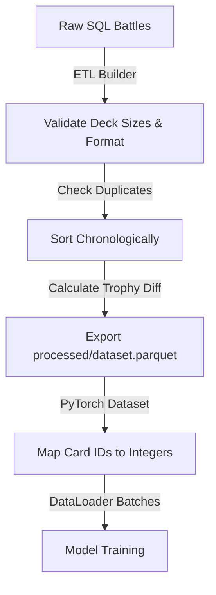

# Production Implementation Design Blueprint (Sprint 9)

**Prepared by**: Staff Machine Learning Engineer & Systems Architect  
**Date**: July 17, 2026  
**Target**: Implementation Blueprint for Siamese Bradley-Terry Clash Royale Predictor

---

## 1. Repository Architecture

We propose the following modular folder structure to transition our research pipelines to a production-grade ML codebase:

```
clash-royale-ml/
├── api/                       # Production inference API
│   ├── __init__.py
│   ├── app.py                 # FastAPI endpoints
│   └── schemas.py             # Request/Response models
├── config/                    # Run configurations and settings
│   ├── __init__.py
│   ├── hyperparams.yaml       # Model and optimizer hyperparams
│   └── settings.py            # Global paths and environmental variables
├── data/                      # Local data registry (ignored in git)
│   ├── raw/                   # SQLite databases
│   └── processed/             # Parquet datasets
├── features/                  # Feature engineering libraries
│   ├── __init__.py
│   ├── card_library.json
│   └── feature_engine.py
├── models/                    # PyTorch model structures
│   ├── __init__.py
│   ├── deck_encoder.py        # Card embeddings & Deep Sets encoder
│   ├── interaction_head.py    # Bradley-Terry bilinear interaction module
│   └── predictor.py           # Combined system wrapper
├── preprocessing/             # Preprocessing & ETL scripts
│   ├── __init__.py
│   └── dataset_builder.py     # Data validation & clean builders
├── scripts/                   # Utility and deployment scripts
│   └── dataset_report.py
├── tests/                     # Unit and integration test suites
│   ├── test_api.py
│   ├── test_dataset.py
│   ├── test_math_constraints.py
│   └── test_model.py
├── training/                  # Training & evaluation scripts
│   ├── __init__.py
│   ├── loss_functions.py      # Bradley-Terry likelihood losses
│   ├── trainer.py             # PyTorch training loops
│   └── evaluator.py           # Metrics and calibration evaluations
├── logs/                      # Log registries
│   └── experiments.json
├── README.md
├── requirements.txt
└── setup.py
```

---

## 2. Data Flow & Preprocessing Pipeline

The preprocessing and data flow pipeline is designed as follows:



### Data Pipeline Details:
1.  **Format**: The intermediate artifact `data/processed/dataset.parquet` will contain the columns: `player_deck` (json string), `opponent_deck` (json string), `win` (0/1), `player_trophies` (int), `opponent_trophies` (int), `battle_time` (string).
2.  **Caching**: Pre-processed datasets are cached in Parquet format. If `dataset.parquet` exists, the pipeline skips ETL and loads directly.
3.  **Reproducibility**: Training/Val/Test splits are cached as integer index lists (`train_indices.json`, `val_indices.json`, `test_indices.json`) using a fixed seed (`42`), ensuring identical splits across all runs.

---

## 3. Dataset Design

We define the PyTorch dataset structure for batch loading:

### Dataset Class Definition (Conceptual):
```python
import torch
from torch.utils.data import Dataset

class ClashRoyaleDataset(Dataset):
    """
    Loads Clash Royale battles, maps card IDs to continuous integer indices,
    and returns PyTorch tensors.
    """
    def __init__(self, df: pd.DataFrame, card_to_idx: dict):
        self.win = torch.tensor(df["win"].values, dtype=torch.float32)
        
        # Parse decks and map to card indices [0, C-1]
        self.p1_decks = torch.tensor(
            [[card_to_idx[str(c)] for c in json.loads(d)] for d in df["player_deck"]],
            dtype=torch.long
        )
        self.p2_decks = torch.tensor(
            [[card_to_idx[str(c)] for c in json.loads(d)] for d in df["opponent_deck"]],
            dtype=torch.long
        )
        
        # Trophy differences
        self.trophy_diff = torch.tensor(
            df["player_trophies"].values - df["opponent_trophies"].values,
            dtype=torch.float32
        )

    def __len__(self):
        return len(self.win)

    def __getitem__(self, idx):
        return {
            "p1_deck": self.p1_decks[idx],       # Shape: [8]
            "p2_deck": self.p2_decks[idx],       # Shape: [8]
            "trophy_diff": self.trophy_diff[idx], # Shape: []
            "target": self.win[idx]              # Shape: []
        }
```

*   **Shapes**: Input tensors for decks are `[Batch_Size, 8]`. Targets and trophy differences are `[Batch_Size]`.
*   **Data Augmentation**: Symmetrizing data. With 50% probability during training, swap Player 1 and Player 2 decks, negate the trophy difference, and invert the win target ($1 - y$). This doubles our dataset size and forces the model to respect anti-symmetry during weight updates.

---

## 4. Model Components

We deconstruct the Siamese Bradley-Terry network into independent modules:

```
                   +----------------------------------+
                   |          ClashRoyalePredictor    |
                   +-----------------+----------------+
                                     |
             +-----------------------+-----------------------+
             |                                               |
             v                                               v
+------------+------------+                     +------------+------------+
|    SiameseDeckEncoder   |                     |     SkillDifferenceNet  |
+------------+------------+                     +------------+------------+
             |                                               |
             v                                               |
+------------+------------+                                 |
|  BradleyTerryBilinear   |                                 |
+------------+------------+                                 |
             |                                               |
             +-----------------------+-----------------------+
                                     |
                                     v
                        +------------+------------+
                        |      Sigmoid Predictor  |
                        +-------------------------+
```

### Module Responsibilities:
1.  **SiameseDeckEncoder**:
    *   *Input*: Deck tensor `[Batch_Size, 8]`.
    *   *Output*: Deck latent vector `[Batch_Size, 16]`.
    *   *Components*: A card embedding lookup table of shape `[122, 16]` followed by a Deep Sets average or sum pooling layer across the card dimension.
2.  **BradleyTerryBilinear**:
    *   *Input*: Deck latent vectors $v_A, v_B \in \mathbb{R}^{16}$.
    *   *Output*: Scalar matchup score $\theta(D_A, D_B) = v_A^T W v_B$.
    *   *Constraint*: To guarantee anti-symmetry, the weight matrix $W$ is parameterized as $W = M - M^T$, where $M \in \mathbb{R}^{16 \times 16}$ is a learnable matrix.
3.  **SkillDifferenceNet**:
    *   *Input*: Trophy difference tensor `[Batch_Size]`.
    *   *Output*: Skill bias scalar $\gamma = w_s \cdot \Delta T$.

---

## 5. Training Pipeline

*   **Loss Function**: Binary Cross-Entropy on logit differences:
    $$\mathcal{L} = -\frac{1}{N} \sum_{i=1}^N \left[ y_i \log(\sigma(\theta_i + \gamma_i)) + (1-y_i) \log(1 - \sigma(\theta_i + \gamma_i)) \right]$$
*   **Optimizer**: AdamW with `learning_rate = 1e-3` and weight decay $1e-4$ specifically on embedding parameters.
*   **Mixed Precision**: Enable PyTorch `torch.cuda.amp.autocast()` to accelerate GPU training.
*   **Logging**: Record training/validation loss, accuracy, and ECE at each epoch to a local JSON experiments registry.
*   **Early Stopping**: Stop training if validation loss fails to decrease for 10 consecutive epochs. Save the model checkpoint containing the lowest validation loss.

---

## 6. Reusable Evaluation Framework

The evaluation module (`training/evaluator.py`) will compute:
1.  **Test Set Metrics**: Accuracy, Log Loss, ROC-AUC, Brier Score.
2.  **Calibration**: Expected Calibration Error (ECE) and bin reliability arrays.
3.  **Mathematical Symmetry Check**:
    *   Verify that $A(D_i, D_i) == 0.5000 \pm 1e-5$ for 1,000 random decks.
    *   Verify that $A(D_i, D_j) + A(D_j, D_i) == 1.0000 \pm 1e-5$.
4.  **Hard Counter Slices**: Evaluate accuracy on Giant vs Inferno matchups.

---

## 7. Experiment Tracking System

*   **Config Management**: Run parameters are defined in YAML configs (e.g. `config/hyperparams.yaml`):
    ```yaml
    model:
      embedding_dim: 16
      pool_strategy: "mean"
    optimizer:
      lr: 0.001
      weight_decay: 0.0001
    training:
      epochs: 100
      batch_size: 256
      seed: 42
    ```
*   **Registry**: Output metrics and the Git commit hash are saved to `logs/experiments.json`.
*   **Model Checkpointing**: Save PyTorch model state dicts to `models/checkpoints/` named as `model_<run_id>_val_loss_<loss_val:.4f>.pt`.

---

## 8. Baseline Catalog

Before training the Siamese network, we establish the following baseline benchmarks:
1.  **Dummy Classifier**: Always predicts the majority class. Sets the absolute lower bound.
2.  **One-Hot Logistic Regression**: Established in Sprint 6 (56.58% accuracy). Sets the target performance baseline.
3.  **LightGBM/XGBoost on One-Hot**: Gradient boosting on one-hot features. Evaluates non-linear baselines.
4.  **Simple Deep Sets (No skill model)**: A Siamese Deep Sets model trained without trophy inputs. Quantifies the impact of causal confounding adjustment.

---

## 9. Implementation Roadmap

```
  Sprint 10       Sprint 11       Sprint 12       Sprint 13       Sprint 14       Sprint 15       Sprint 16       Sprint 17       Sprint 18
[DataLoader] --> [Baselines] --> [Embeddings] --> [Deep Sets] --> [BT Bilinear] --> [Training] --> [Evaluation] --> [ FastAPI ] --> [Deployment]
```

*   **Sprint 10 (PyTorch DataLoader)**: Build index splits and the PyTorch Dataset class.
*   **Sprint 11 (Baselines Catalog)**: Code baseline scripts (LR, LightGBM).
*   **Sprint 12 (Card Embedding Layer)**: Code SVD co-occurrence pre-training.
*   **Sprint 13 (Deep Sets)**: Code average pooling encoder layer.
*   **Sprint 14 (Bradley-Terry Head)**: Implement antisymmetric bilinear interaction.
*   **Sprint 15 (Training Loop)**: Code optimizer loops with early stopping.
*   **Sprint 16 (Evaluation module)**: Implement ECE and symmetry tests.
*   **Sprint 17 (FastAPI API)**: Write FastAPI app with `do(Skill Diff=0)` inference.
*   **Sprint 18 (Dockerization & Deployment)**: Set up Docker configuration files.

---

## 10. Engineering Risks & Mitigations

*   **Gradient Explosion in Embeddings**: Extreme values in card embeddings caused by rare card outliers.
    *   *Mitigation*: Apply gradient clipping (`torch.nn.utils.clip_grad_norm_`) with a threshold of 1.0.
*   **Memory Bottlenecks during SVD**: Creating a dense $122 \times 122$ matrix is small; however, full-database sparse deck calculations could exceed memory limits.
    *   *Mitigation*: Use SciPy sparse libraries (`scipy.sparse.coo_matrix`) to populate matrices before SVD.

---

## 11. Testing Strategy

1.  **Unit Tests**:
    *   Verify that `ClashRoyaleDataset` returns correctly shaped tensors: `p1_deck` shape `[8]`.
2.  **Mathematical Constraint Tests**:
    *   Verify that feeding identical decks to `BradleyTerryBilinear` outputs a score of exactly $0.0000$, yielding $P(A \text{ vs } A) = 0.5000$.
    *   Verify that swapping deck order exactly negates the bilinear score.
3.  **Integration Tests**:
    *   Run a mock 5-epoch training loop to verify end-to-end backpropagation and model state saving.
4.  **Inference Tests**:
    *   Call the API with two mock decks and verify that it returns a scalar float probability within $[0.0, 1.0]$.

---

## 12. Final Go/No-Go Readiness Assessment

### Verdict: **GO**

### Justification:
The repository layout, data schemas, PyTorch tensor structures, and math equations are completely defined. The roadmap defines testable milestones, ensuring the Staff ML Engineer can proceed to implementation without design ambiguity.
